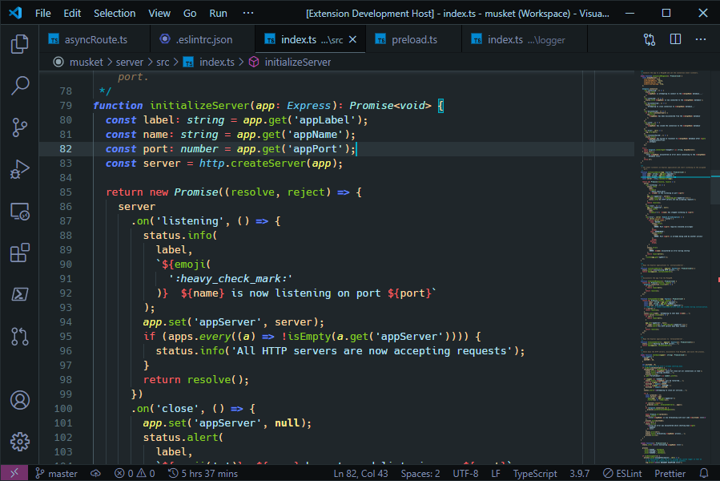

# Schwifty

Schwifty is a dark theme for [VS Code](https://code.visualstudio.com/).

## Installation (How to get Schwifty)

1. Open the **Extensions** sidebar on VS Code (`ctrl+shift+X` or navigate to *View* > *Extensions*).
2. Enter `Schwifty` into the search field.
3. Click **Install**.
4. Use your preferred method to select *Schwifty* as your theme:
    - Click *Set Color Theme* on the **Extensions: Schwifty** details page.
    - Navigate to *File* > *Preferences* > *Color Theme* (or press `ctrl-K ctrl-C`) and select *Schwifty* from the dropdown list.
    - Open the Command Palette (`ctrl+shift+P`), enter `color theme` at the prompt, and select *Schwifty* from the dropdown list.
5. Now that you have gotten Schwifty, it's time to stay schwifty.

## Schwiftied Screenshots

Schwifty Theme using the [Material Icon Theme](https://marketplace.visualstudio.com/items?itemName=PKief.material-icon-theme) and [Roboto Mono](https://fonts.google.com/specimen/Roboto+Mono) font.

## Acknowledgements
