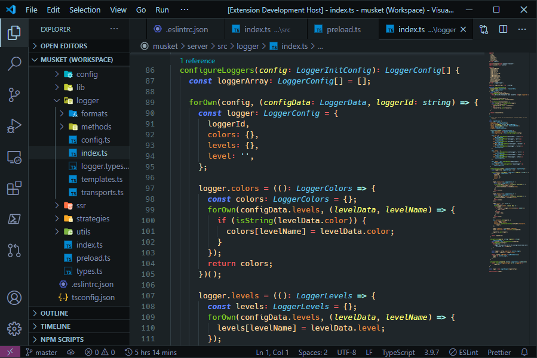
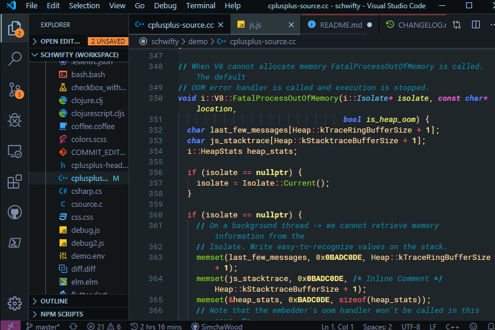
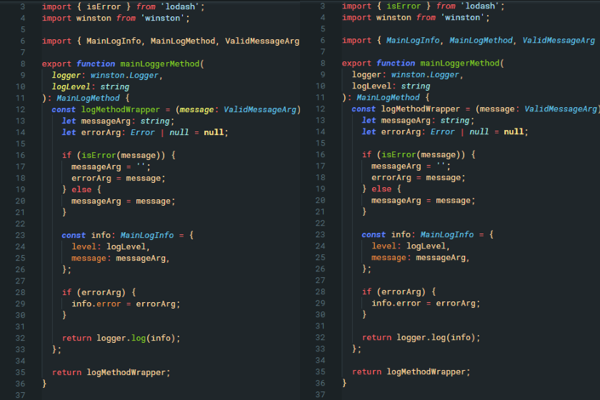

# Schwifty

Schwifty is a dark [VS Code](https://code.visualstudio.com/) theme.

## Installation (How to get Schwifty)

1. Open the **Extensions** sidebar on VS Code (`ctrl+shift+X` or navigate to _View_ > _Extensions_).
2. Enter `Schwifty` into the search field.
3. Click **Install**.
4. Use your preferred method to select _Schwifty_ as your theme:
   - Click _Set Color Theme_ on the **Extensions: Schwifty** details page.
   - Navigate to _File_ > _Preferences_ > _Color Theme_ (or press `ctrl-K ctrl-C`) and select _Schwifty_ from the dropdown list.
   - Open the Command Palette (`ctrl+shift+P`), enter `color theme` at the prompt, and select _Schwifty_ from the dropdown list.
5. Now that you have gotten Schwifty, it's time to stay Schwifty.

## Schwiftied Screenshots

Schwifty Theme using the [Material Icon Theme](https://marketplace.visualstudio.com/items?itemName=PKief.material-icon-theme) and [Roboto Mono](https://fonts.google.com/specimen/Roboto+Mono) font:

Schwifty Theme with TypeScript file (right half of image shows file with VS Code's semantic highlighting enabled):

## Making Schwifty Even Schwiftier

Suggestions are always welcome. Any issues or suggestions should be submitted through [GitHub](https://github.com/SimchaWood/schwifty/issues).

## Acknowledgements

> **schwifty** \\&#712;shwif-tē\\ [Yiddish &#x05e9;&#x05f0;&#x05d9;&#x05e4;&#x05bf;&#x05d8;&#x05d9;&#x05e7;] _adj_ **:** in a state or condition of which any explanation or characterization would be incomprehensible to those not currently experiencing it

The demo files found in [Sarah Drasner's Night Owl](https://marketplace.visualstudio.com/items?itemName=sdras.night-owl&WT.mc_id=twitter-social-sdras) and [Wes Bos's Cobalt2](https://marketplace.visualstudio.com/items?itemName=wesbos.theme-cobalt2&WT.mc_id=github-theme-sdras) themes were particularly useful in the development and testing of this theme.

The Schwifty color palette was inspired by my unhealthy obsession with Adult Swim's [Rick and Morty](https://www.rickandmorty.com/).
